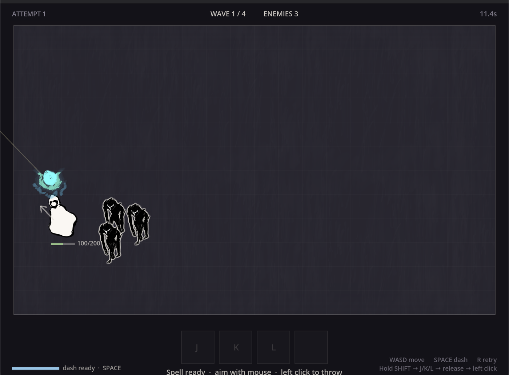

# Amalgaform

A top-down spell-crafting arena, built in ten working days as a Game track
rotation at the Apple Developer Academy @ BINUS. Godot 4.7, GDScript.



**You hold a key, queue up to four runes, release, then throw.** The first rune
decides the *shape* of the spell. The whole queue decides what is *inside* it.
Same three runes in a different order give you a completely different spell.

| First rune | Shape | Then the rest of the queue fills it |
|---|---|---|
| Fire | fast single-target bullet | damage · wet · knockback |
| Water | ball that bursts into a lingering puddle | damage · wet · knockback |
| Wind | area blast around the impact point | damage · wet · knockback |

Fire → Fire is a hotter bullet. Fire → Water is a bullet that also soaks.
Water → Fire is a puddle that burns whatever stands in it. That grammar is the
whole game.

While the queue is open, time slows — and the slowdown decays, so hesitating
costs you.

## Controls

| Key | |
|---|---|
| `WASD` | move |
| `SPACE` | dash |
| `SPACE` | start, from the title screen |
| `SHIFT` (hold) | open the rune queue, time slows |
| `J` `K` `L` | queue fire · water · wind |
| release `SHIFT` | cast |
| left click | throw at the cursor |
| `ESC` | pause (or cancel the rune queue while it is open) |
| `R` | retry |
| `F1` | component badges (ECS debug view) |
| `F11` | fullscreen |

## Running it

```
godot --path challenge-6
godot --path challenge-6 -- --demo     # scripted input, no hands needed
```

## How it is built

The project is split in two halves on purpose.

`challenge-6/sim/` is a hand-written ECS. Entities are bare ints. Components
are plain data. Systems are static functions with no memory between frames.
Rules that are actually enforced:

- whatever a system reads goes in its query
- component presence *is* the flag; there are no boolean fields
- systems never call other systems, they talk through the World
- anything derivable from the World is never stored
- anything that controls time uses raw delta, never scaled delta
- archetypes are not types — nothing anywhere records that an entity "is an
  enemy", there is only an entity with some components

`challenge-6/view/` is strictly read-only. It never writes into the World. If
you deleted the whole folder the simulation would still run — it would just be
invisible. Effects that need memory (death bursts, dash afterimages, sound)
keep it in the view layer and derive it by comparing this frame's World to the
last one. Death, for instance, has no component and does not need one: a dead
enemy is an id that existed last frame and does not exist now.

`challenge-6/tools/` are small scripts that exist because guessing was slower
than measuring — a spell-placement probe, audio trimming and levelling, map
slicing.

Design notes, the deliberate debt list, and the asset spec live in
`DESIGN.md`, `NOTES.md` and `ASSETS.md` (written in Indonesian).

## Assets

All art is hand-drawn for this project. Monster sounds are my own voice,
recorded and processed with the scripts in `tools/`. Some sound effects are
derived from royalty-free libraries (Sonniss GDC bundle, Kenney).

## Status

Ten day rotation project, not a product. It is finished in the sense that it
has a beginning, four waves, a win screen and a lose screen — and unfinished in
every other sense.
